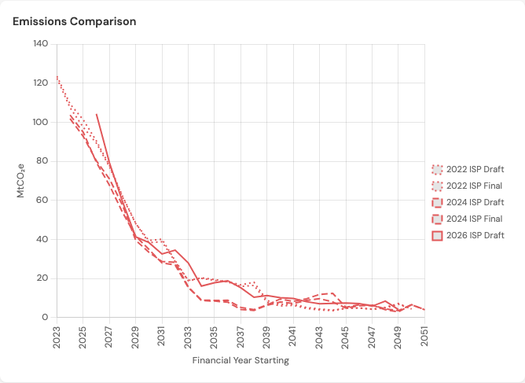

<a href="https://opennem.github.io/IspParser/#compare=true"></a>

**[View verification charts on GitHub Pages](https://opennem.github.io/IspParser/)**

# ISP Workbook Parser

A Python script for generating JSON representations from AEMO's ISP Outlook (Excel) Workbooks.

## Usage

```bash
python src/ispparser.py
python src/ispparser.py --use-cache     # skip reprocessing if cached parquet files exist
python src/ispparser.py --input /path/to/input --output /path/to/output
python src/ispparser.py --config /path/to/report_config.json
```

| Flag | Default | Description |
|---|---|---|
| `--use-cache` | off | Skip reprocessing if cached parquet files exist |
| `--input` | `input/` | Input folder containing ISP workbooks |
| `--output` | `output/` | Output folder for generated files |
| `--config` | `src/report_config.json` | Path to report config JSON |
| `--max-to-process` | no limit | Max scenario workbooks to process per release |

## Output Files

Each scenario in a release is output as a JSON file in the `output` folder corresponding to the release. The scenario file includes the capacity, energy, emissions and cost data for each development pathway, and each region (where available) and an `_all` region, being the sum of all regions.

For example, the `step_change` scenario from the `2024 final ISP` release will be generated to `output/releases/2024_ISP_final/step_change.json`.

### Download Output Files

* [2022_ISP_draft.zip](site/2022_ISP_draft.zip)
* [2022_ISP_final.zip](site/2022_ISP_final.zip)
* [2024_ISP_draft.zip](site/2024_ISP_draft.zip)
* [2024_ISP_final.zip](site/2024_ISP_final.zip)
* [2026_ISP_draft.zip](site/2026_ISP_draft.zip)

## Supported ISP Releases

#### 2022 ISP Draft

* all data in calendar years, from 2024 to 2051
* capacity includes `Existing and Committed` column
* includes emissions for NEM (which we map to `_all`)

#### 2022 ISP Final

* all data in calendar years, from 2024 to 2051
* capacity includes `Existing and Committed` column
* includes emissions for NEM (which we map to `_all`)

#### 2024 ISP Draft

* all data in calendar years, from 2025 to 2052
* capacity data as of 1 July in each year
* CDP names normalised (`CDP11 (ODP)` → `CDP11`, `Least-cost DP` rows dropped)

#### 2024 ISP Final

* all data in _financial years_, from 2024-25 to 2051-52
* introduces Subregions (collapsed during processing)
* emissions per region

#### 2026 ISP Draft

* all data in _financial years_, from 2026-27 to 2049-50
* 3 scenarios: Step Change, Accelerated Transition, Slower Growth
* renamed technology labels (e.g. `Rooftop and other small-scale solar`)
* new cost category labels (14 categories including retirement, distribution, system security)
* 24 CDPs including Counterfactual

## Interactive Charts

An interactive chart viewer comparing generation, capacity, emissions, and costs across all ISP releases is published via [GitHub Pages](https://opennem.github.io/IspParser/).

## Contact

 - File an issue or contact the author on Twitter at [@simonahac](https://twitter.com/simonahac)
