# ISP Workbook Parser — Reference Output

Cross-release comparison of **Step Change** scenario (NEM-wide, CDP1/CDP2).

Line styles: **solid** = 2026 ISP Draft, **dashed** = 2024 ISP, **dotted** = 2022 ISP.

## Coal

| Generation | Capacity |
|:---:|:---:|
| 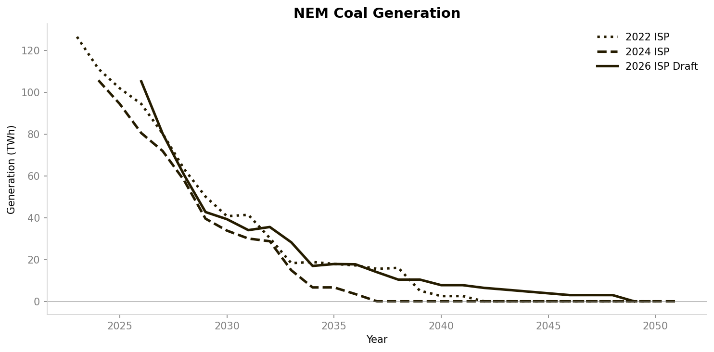 | 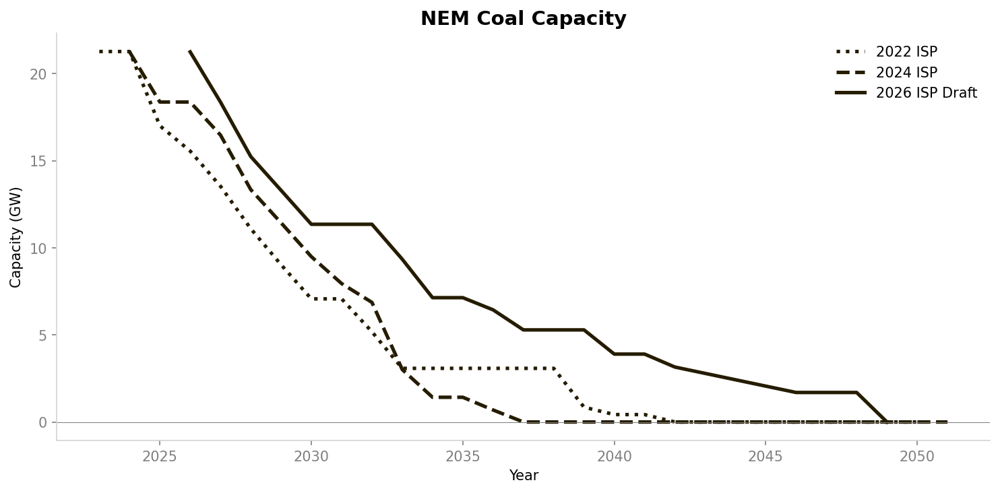 |

## Gas

| Generation | Capacity |
|:---:|:---:|
| 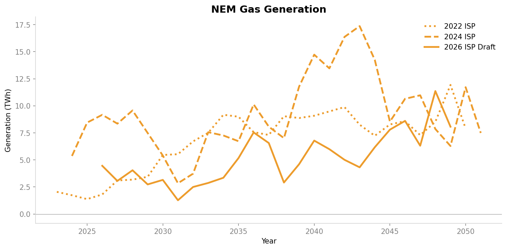 | 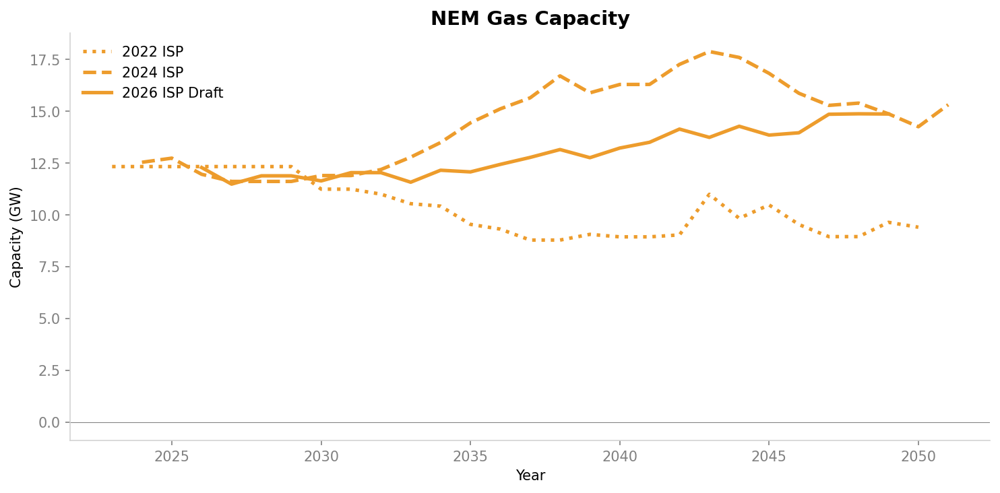 |

## Wind

| Generation | Capacity |
|:---:|:---:|
| 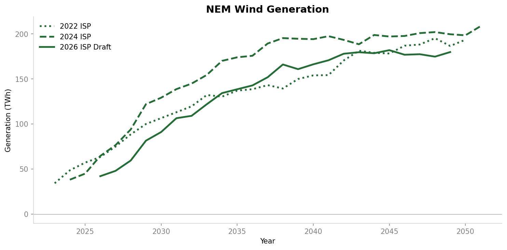 | 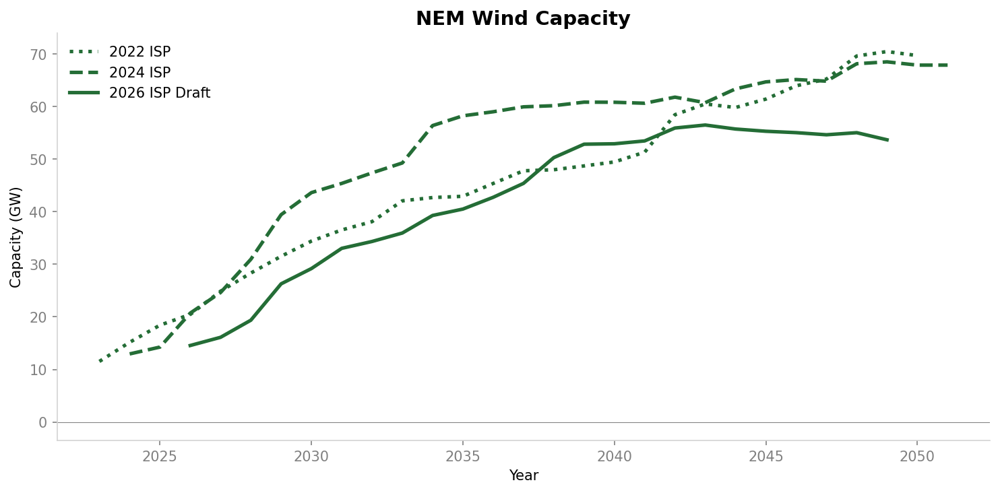 |

## Solar

| Generation | Capacity |
|:---:|:---:|
| 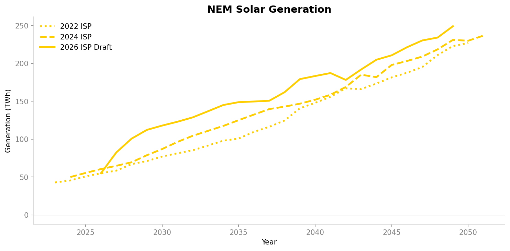 | 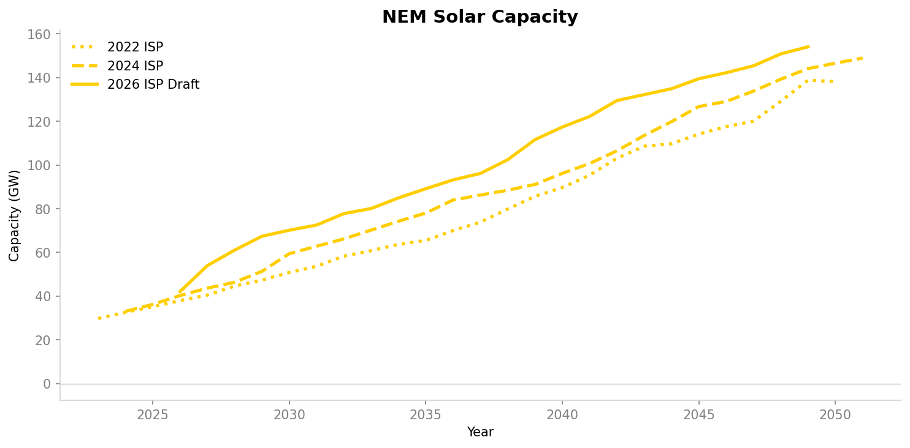 |

## Battery

| Generation | Capacity |
|:---:|:---:|
| 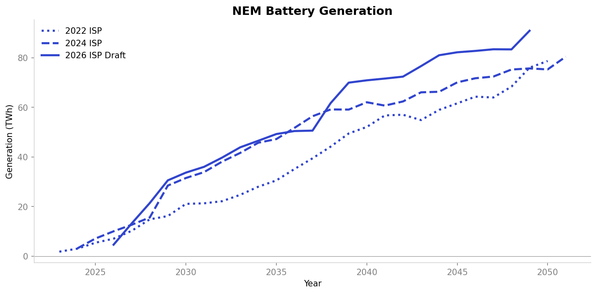 | 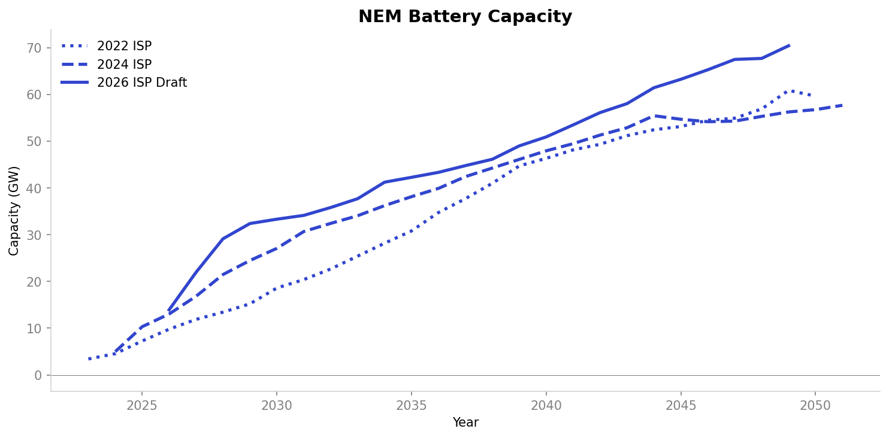 |

## Hydro

| Generation | Capacity |
|:---:|:---:|
| 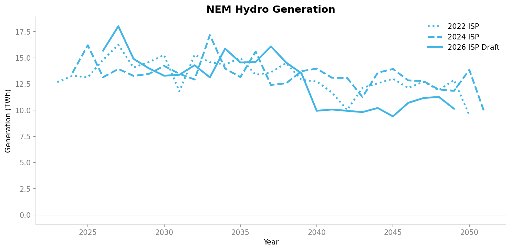 | 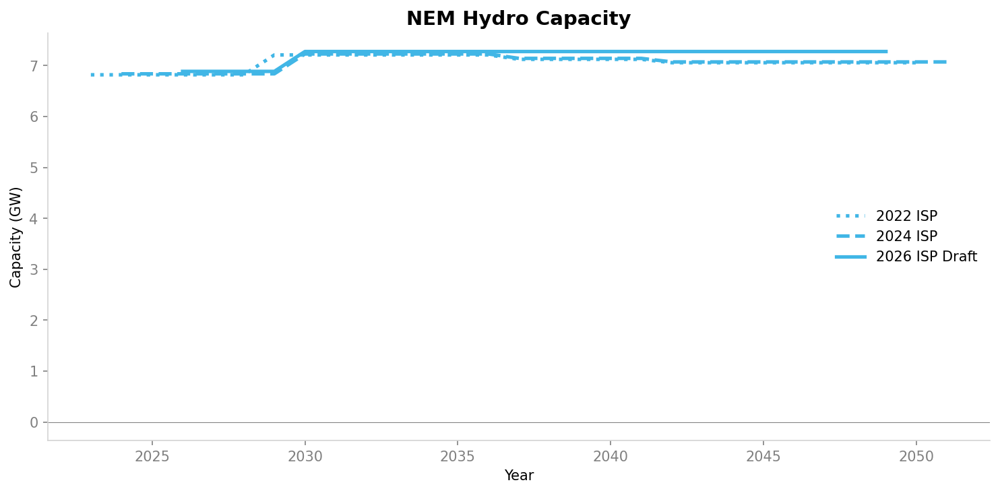 |

## Emissions

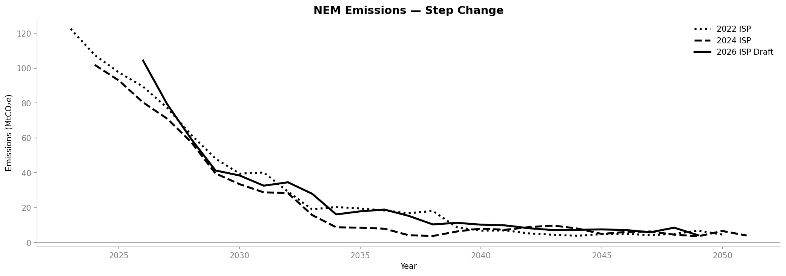

---

## Per-release detail charts

- [2022 ISP](2022_ISP_final/)
- [2024 ISP](2024_ISP_final/)
- [2026 ISP Draft](2026_ISP_draft/)

## Download Output Files

- [2022_ISP_final.zip](2022_ISP_final.zip)
- [2024_ISP_final.zip](2024_ISP_final.zip)
- [2026_ISP_draft.zip](2026_ISP_draft.zip)

